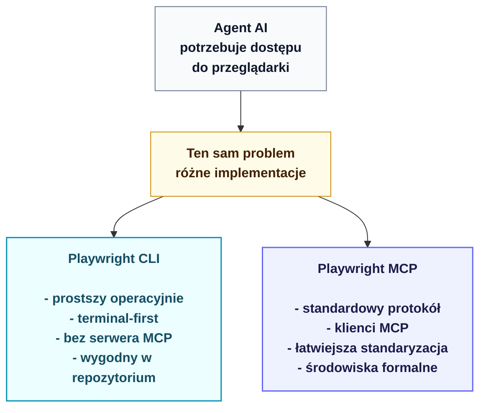

# Bonus: Playwright CLI vs Playwright MCP

Ten bonus porównuje dwa sposoby używania Playwrighta w pracy z agentami AI: **Playwright CLI** z repozytorium `microsoft/playwright-cli` oraz **Playwright MCP** z repozytorium `microsoft/playwright-mcp`.

Oba narzędzia rozwiązują podobny problem: pozwalają agentowi sterować przeglądarką. Oba mogą też dobrze działać w pracy agenta kodującego. Różnica jest bardziej subtelna: Playwright CLI jest bardziej terminalowe i bezpośrednie, a Playwright MCP jest bardziej protokołowe i integracyjne. W praktyce wybór zależy mniej od samego Playwrighta, a bardziej od tego, czy Twój workflow opiera się na terminalu, czy na kliencie AI z dobrze skonfigurowanym MCP.

## Najpierw ważne rozróżnienie

Playwright CLI w tym bonusie nie oznacza klasycznego:

```bash
npx playwright test
```

`npx playwright test` to runner testów Playwrighta. Uruchamia testy, raportuje wyniki i jest podstawowym narzędziem w projekcie testowym.

`playwright-cli` z `microsoft/playwright-cli` jest czymś innym. To osobny interfejs do sterowania przeglądarką z terminala. Agent może dzięki niemu otworzyć stronę, pobrać snapshot, kliknąć element, wpisać tekst, zrobić screenshot albo zamknąć sesję:

```bash
playwright-cli open https://example.com
playwright-cli snapshot
playwright-cli click e15
playwright-cli fill e21 "test@example.com"
playwright-cli screenshot
playwright-cli close
```

Warto więc myśleć o nim jako o warstwie do eksploracji, debugowania i zbierania wiedzy o stronie. Nie zastępuje testów w `@playwright/test`; raczej pomaga agentowi lepiej zrozumieć aplikację przed napisaniem testu.

## Czym jest Playwright CLI

Playwright CLI to terminalowy interfejs do Playwrighta zaprojektowany z myślą o agentach AI. Jego główna zaleta jest bardzo prosta: agent nie musi dostawać dużego zestawu narzędzi MCP ani pełnej struktury strony w kontekście modelu. Może wykonać krótką komendę, dostać zwięzły wynik i przejść dalej.

To dobrze pasuje do pracy agenta kodującego. Taki agent i tak działa w terminalu, czyta pliki, edytuje kod i uruchamia testy. Jeśli w tym samym stylu może też zbadać aplikację w przeglądarce, workflow jest spójny. Playwright CLI potrafi utrzymywać osobne sesje przez `-s=nazwa-sesji`, zapisywać i odtwarzać stan przeglądarki, robić snapshoty, screenshoty, trace, video, obsługiwać storage i uruchamiać własny kod Playwrighta przez `run-code`.

Przykład izolowanej sesji może wyglądać tak:

```bash
playwright-cli -s=auth open https://app.example.com/login
playwright-cli -s=auth snapshot
playwright-cli -s=auth fill e1 "user@example.com"
playwright-cli -s=auth fill e2 "password"
playwright-cli -s=auth click e3
playwright-cli -s=auth state-save auth.json
playwright-cli -s=auth close
```

W projekcie testowym takie podejście jest szczególnie przydatne przed implementacją testu. Agent może wejść na stronę, sprawdzić dostępne role, teksty i stany po kliknięciach, a dopiero potem napisać Page Object i test Playwrighta.

## Czym jest Playwright MCP

Playwright MCP działa inaczej. To serwer Model Context Protocol, który udostępnia agentowi narzędzia do automatyzacji przeglądarki przez standard MCP. Agent nie steruje przeglądarką bezpośrednio komendami terminalowymi, tylko komunikuje się z serwerem MCP, a serwer wykonuje akcje w Playwrightcie i zwraca strukturalne informacje o stronie.

Ten model dobrze pasuje do środowisk, które już obsługują MCP. Jeśli ktoś pracuje w edytorze albo kliencie AI z natywną integracją MCP, Playwright MCP można potraktować jako kolejne narzędzie podłączone do tego ekosystemu. Dużą zaletą jest też to, że interakcje opierają się na strukturalnych snapshotach dostępności, więc nie trzeba polegać na modelach wizyjnych, żeby agent rozumiał, co znajduje się na stronie.

MCP jest więc wygodne wtedy, gdy workflow jest zbudowany wokół klientów MCP i chcemy standardowego sposobu komunikacji między klientem AI a automatyzacją przeglądarki.

## Porównanie praktyczne

| Kryterium | Playwright CLI | Playwright MCP |
| --- | --- | --- |
| Główny interfejs | Terminal | Serwer MCP |
| Najlepsze dopasowanie | Agenci kodujący pracujący w repozytorium | Klienci i edytory z natywną obsługą MCP |
| Koszt kontekstu modelu | Zwykle niższy, bo agent wykonuje krótkie komendy, a artefakty zostają lokalnie | Zwykle wyższy, bo klient MCP musi obsługiwać schematy narzędzi i snapshoty |
| Integracja z repo | Naturalna: komendy CLI, pliki, artefakty, testy, trace | Zależna od klienta MCP i konfiguracji serwera |
| Styl pracy | Terminal-first, dobrze pasuje do automatyzacji przez agenta | Tool-first, dobrze pasuje do interaktywnej pracy w kliencie MCP |
| Izolacja sesji | Jawne sesje przez `-s=nazwa` i profile | Zależna od konfiguracji serwera MCP i klienta |
| Artefakty | Snapshoty, screenshoty, trace, video, storage state w lokalnym workflow | Snapshoty i akcje dostępne przez protokół MCP |
| Debugowanie w repo | Łatwe do połączenia z komendami `npm`, testami i plikami projektu | Dobre do eksploracji, ale bardziej zależne od integracji narzędzia |

## Jak ja o tym myślę

Osobiście najczęściej wybieram Playwright CLI, bo jest prostszy operacyjnie. Nie muszę pamiętać o uruchamianiu i wyłączaniu serwera MCP, nie dokładam kolejnej warstwy konfiguracji i mogę traktować eksplorację przeglądarki jak zwykły element pracy w terminalu.

W bardziej sformalizowanych środowiskach, np. korporacyjnych albo bankowych, Playwright MCP może być bezpieczniejszą i łatwiejszą do ustandaryzowania opcją. MCP daje wyraźny protokół integracji narzędzi, lepiej pasuje do centralnie zarządzanych klientów AI i może być naturalniejszy tam, gdzie ważne są kontrola dostępu, audytowalność i powtarzalna konfiguracja środowiska.

Na końcu oba produkty rozwiązują ten sam problem: dają agentowi dostęp do przeglądarki. W praktyce warto traktować je jako różne implementacje tej samej idei, a nie jako narzędzia z zupełnie innych światów.



## Źródła i materiały

- Awesome Testing, artykuł o Playwright CLI, skillach i izolowanej pracy agentów: <https://www.awesome-testing.com/2026/03/playwright-cli-skills-and-isolated-agentic-testing>
- Microsoft Playwright CLI: <https://github.com/microsoft/playwright-cli>
- Microsoft Playwright MCP: <https://github.com/microsoft/playwright-mcp>
- Dokumentacja Playwright MCP: <https://playwright.dev/docs/getting-started-mcp>
- Dokumentacja Playwrighta: <https://playwright.dev/docs/intro>
- Playwright Locators: <https://playwright.dev/docs/locators>
- Playwright Test Generator: <https://playwright.dev/docs/codegen>
- Model Context Protocol: <https://modelcontextprotocol.io/>

Stan na: 2026-06-24.
